# CS231n 2025 学习笔记（六）：训练 CNN 与经典 CNN 架构

> 对应课程：Stanford CS231n Spring 2025 Lecture 6 — **Training CNNs and CNN Architectures**。
>
> 本文同时保留了课程 PPT 中的关键图示，并加入了重新绘制的中文概念图。所有图片均使用仓库内相对路径，可直接在 GitHub 中显示。
>
> 这一讲主要回答两个问题：
>
> 1. 一个 CNN 应该由哪些模块搭建？
> 2. 搭好网络后，怎样把它稳定地训练出来？

本讲内容很多，但主线并不复杂：

```text
如何搭建 CNN
├── CNN 中的常用层
├── 激活函数
├── VGG 与 ResNet
└── 权重初始化

如何训练 CNN
├── 数据预处理
├── 数据增强
├── 迁移学习
└── 超参数选择
```

## 目录

- [一、CNN 的基本组成](#一cnn-不只是卷积层堆叠)
- [二、归一化层](#二归一化层把每层数据拉回容易训练的范围)
- [三、Dropout](#三dropout训练时故意让一部分神经元请假)
- [四、激活函数](#四激活函数没有非线性再深的网络也只是线性模型)
- [五、VGG](#五vgg用小卷积核构建更深的网络)
- [六、ResNet](#六resnet让网络学习需要修改多少)
- [七、权重初始化](#七权重初始化过小信号消失过大信号爆炸)
- [八、图像预处理](#八图像预处理训练集验证集和测试集必须用同一把尺子)
- [九、数据增强](#九数据增强不收集新图片也能制造更多训练情况)
- [十、迁移学习](#十迁移学习不要每次都从随机参数开始)
- [十一、超参数选择](#十一超参数选择先确认代码能学再追求高精度)

---

## 一、CNN 不只是“卷积层堆叠”

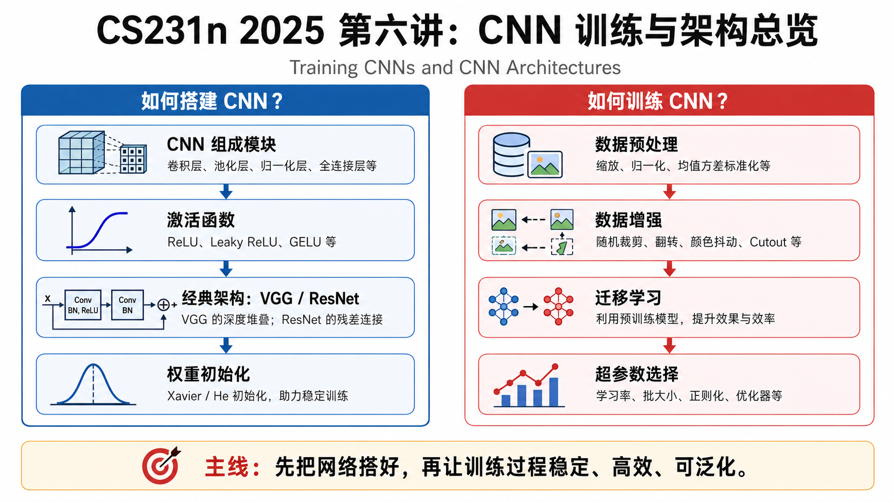

*图 1：本讲内容总览：如何搭建 CNN，以及如何稳定地训练 CNN。*


一个典型 CNN 通常由以下模块组成：

- 卷积层：提取局部特征；
- 池化层或步幅卷积：降低空间分辨率；
- 全连接层或线性层：完成最终分类；
- 归一化层：稳定特征分布；
- 激活函数：引入非线性；
- Dropout：在部分网络中抑制过拟合。

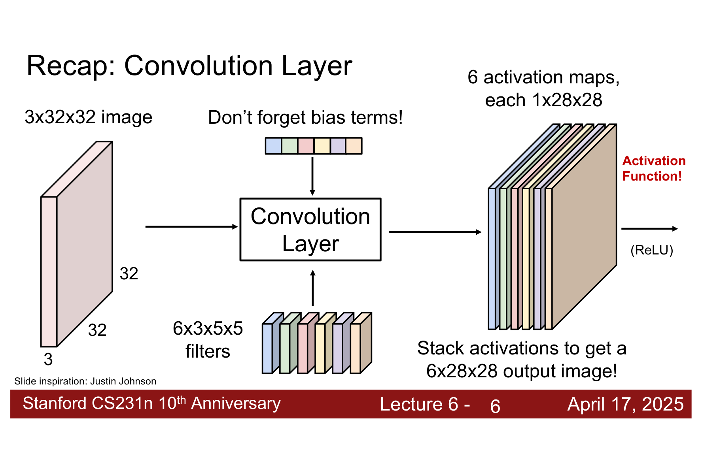

*图 2：卷积层示意图。图源：CS231n 2025 Lecture 6，第 6 页。*

### 1. 卷积层到底输出了什么？

假设输入图像大小为：

$$
3\times32\times32
$$

这里的 3 表示 RGB 三个通道。

如果使用 6 个大小为 $3\times5\times5$ 的卷积核，并且步幅为 1、不填充，那么每个卷积核都会产生一张 $28\times28$ 的特征图：

$$
H_{out}=\frac{32-5}{1}+1=28
$$

最终输出大小为：

$$
6\times28\times28
$$

需要注意：

> 一个卷积核不是只看某一个颜色通道，而是同时覆盖输入的全部通道。

所以每个卷积核的深度必须与输入通道数一致。6 个卷积核会学习 6 种不同的特征，例如边缘、纹理、颜色变化或更复杂的局部结构。

### 2. 池化层的作用

池化层会对局部区域进行汇总，例如最大池化：

$$
\begin{bmatrix}
1 & 1\\
5 & 6
\end{bmatrix}
\rightarrow 6
$$

最大池化保留局部区域中最强的响应，可以理解为：

> 不再精确记录“特征出现在左上角还是右下角”，只关心“这个区域里是否出现了该特征”。

它可以减少计算量，并让模型对较小的位置变化不那么敏感。不过，现代 CNN 也经常使用步幅卷积代替池化层。

---

## 二、归一化层：把每层数据拉回容易训练的范围

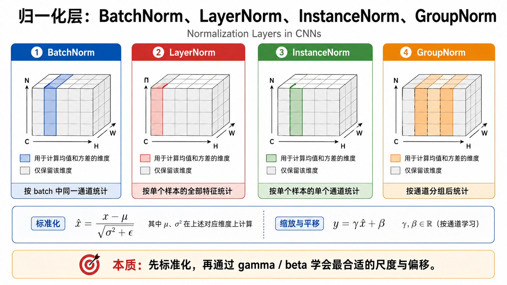

*图 3：BatchNorm、LayerNorm、InstanceNorm 与 GroupNorm 的统计范围对比。*


随着网络加深，不同层输出的数值范围可能不断变化，使后面的层很难训练。

归一化的基本形式是：

$$
\hat{x}=\frac{x-\mu}{\sqrt{\sigma^2+\varepsilon}}
$$

归一化后，再通过可学习参数恢复网络的表达能力：

$$
y=\gamma\hat{x}+\beta
$$

其中：

- $\mu$：均值；
- $\sigma^2$：方差；
- $\varepsilon$：防止分母为零的小常数；
- $\gamma$：可学习的缩放参数；
- $\beta$：可学习的平移参数。

### 1. 为什么归一化后还要乘 $\gamma$、加 $\beta$？

可以把归一化理解为学校先把不同班级的考试成绩统一换算成标准分。

但并不是所有任务都希望数据永远保持均值 0、方差 1。因此网络还需要通过 $\gamma$ 和 $\beta$ 自己决定：

- 特征应该放大多少；
- 特征中心应该移动到哪里。

也就是说：

> 归一化负责把数据整理整齐，$\gamma$ 和 $\beta$ 再让网络学习最合适的尺度与位置。

### 2. BatchNorm、LayerNorm、InstanceNorm 和 GroupNorm 的区别

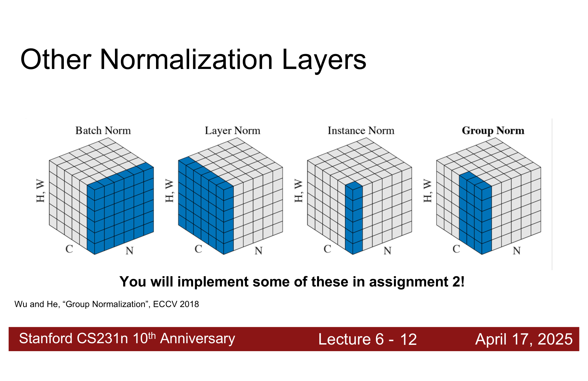

*图 4：四种归一化方法的统计范围。图源：CS231n 2025 Lecture 6，第 12 页。*

对于 CNN 特征张量：

$$
X\in\mathbb{R}^{N\times C\times H\times W}
$$

其中 $N$ 是批量大小，$C$ 是通道数，$H,W$ 是空间尺寸。

| 方法 | 主要统计范围 | 直观理解 |
|---|---|---|
| BatchNorm | 对每个通道统计 $N,H,W$ | 同一个通道的所有样本一起标准化 |
| LayerNorm | 对每个样本统计其特征维度 | 每个样本单独整理自己的全部特征 |
| InstanceNorm | 对每个样本、每个通道统计 $H,W$ | 每张图的每个通道分别标准化 |
| GroupNorm | 将通道分组后统计 | 在 LayerNorm 与 InstanceNorm 之间折中 |

### 3. LayerNorm 的直观例子

假设一个样本的特征是：

$$
x=[10,12,14]
$$

它们整体偏大，但三个特征之间的相对关系是稳定的。LayerNorm 会对这个样本自身的三个特征计算均值和方差，再完成标准化。

如果输入形状是：

$$
x\in\mathbb{R}^{N\times D}
$$

那么 LayerNorm 对每个样本的 $D$ 个特征计算统计量，因此：

$$
\mu,\sigma\in\mathbb{R}^{N\times1}
$$

这也是 LayerNorm 不依赖批量大小的重要原因。

### 4. 应该使用哪一种归一化？

常见经验是：

- 大批量 CNN：BatchNorm 常见；
- 批量很小：GroupNorm 往往更稳定；
- Transformer：通常使用 LayerNorm；
- 图像风格迁移：常使用 InstanceNorm。

归一化不是为了让所有特征永久变成标准正态分布，而是为了让优化过程更稳定。

---

## 三、Dropout：训练时故意让一部分神经元“请假”

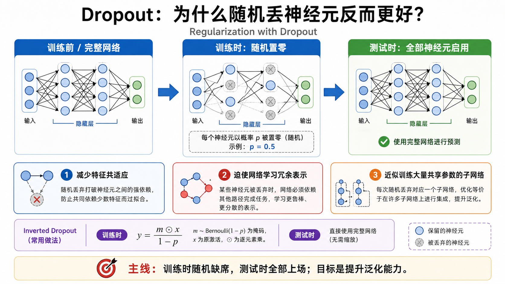

*图 5：Dropout 在训练阶段与测试阶段的工作方式。*


Dropout 在训练阶段随机将部分神经元输出设为 0：

$$
m_i\sim\operatorname{Bernoulli}(1-p)
$$

$$
y_i=m_i x_i
$$

其中 $p$ 是丢弃概率。

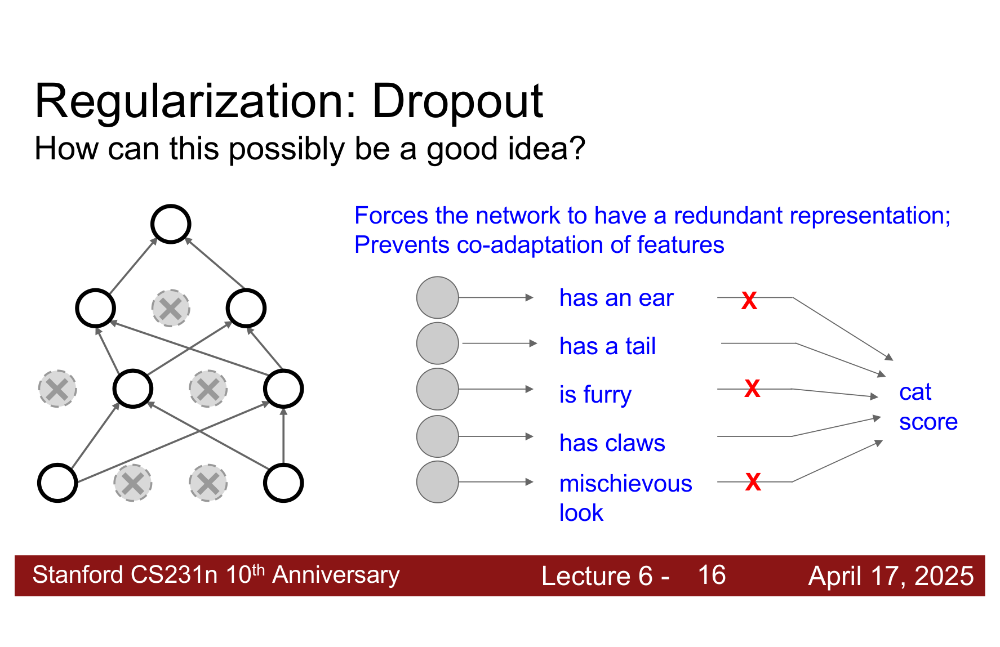

*图 6：Dropout 防止特征之间形成过强依赖。图源：CS231n 2025 Lecture 6，第 16 页。*

### 1. 为什么“破坏网络”反而能提升泛化能力？

假设网络判断一张图片是不是猫，主要依赖以下特征：

```text
耳朵 + 尾巴 + 毛发 + 爪子 + 脸部形状 → 猫
```

如果训练时所有神经元始终存在，网络可能形成一种脆弱的合作方式：

> 只有“耳朵特征”和“尾巴特征”同时出现时，才敢判断为猫。

Dropout 会随机删除其中一些特征。于是网络被迫学习：

- 没看到耳朵时，也能利用毛发和爪子；
- 没看到尾巴时，也能利用脸部形状；
- 不能把全部希望寄托在某一个神经元上。

因此 Dropout 能减少特征之间的“共适应”，促使网络形成更加冗余、更加稳健的表示。

### 2. 另一种理解：训练了大量共享参数的子网络

每一种 Dropout 掩码都对应一个不同的子网络。

如果一层有 4096 个神经元，那么理论上可能存在：

$$
2^{4096}
$$

种不同的开关组合。

当然，我们不可能显式训练这么多网络，但 Dropout 相当于不断采样不同子网络，并让它们共享参数。

### 3. 训练阶段和测试阶段有什么区别？

传统解释是：

```text
训练阶段：随机丢弃神经元
测试阶段：使用全部神经元，并进行尺度补偿
```

目前深度学习框架通常使用 **Inverted Dropout**：

$$
y=\frac{m\odot x}{1-p}
$$

训练时已经除以 $1-p$，所以测试时可以直接使用完整网络，不需要再次缩放。

例如 $p=0.5$，训练时某个神经元保留后的输出会乘 2，从而保证训练阶段输出的期望值与测试阶段一致。

> 注意：训练时要开启 Dropout，验证和测试时必须关闭 Dropout。

---

## 四、激活函数：没有非线性，再深的网络也只是线性模型

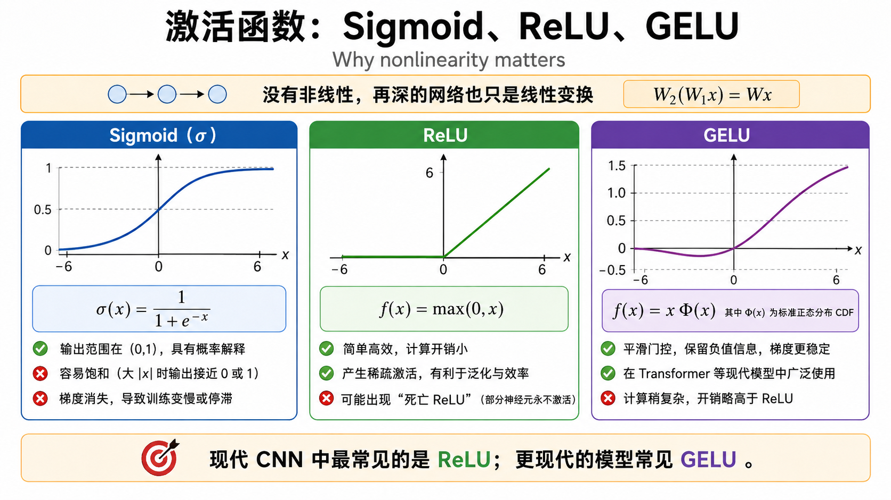

*图 7：Sigmoid、ReLU 与 GELU 的曲线及主要特点。*


如果连续使用两层线性变换：

$$
h=W_1x
$$

$$
y=W_2h
$$

那么：

$$
y=W_2W_1x=Wx
$$

无论堆叠多少层，最终仍然等价于一次线性变换。

激活函数的作用，就是在层与层之间加入非线性，使网络能够表示复杂决策边界。

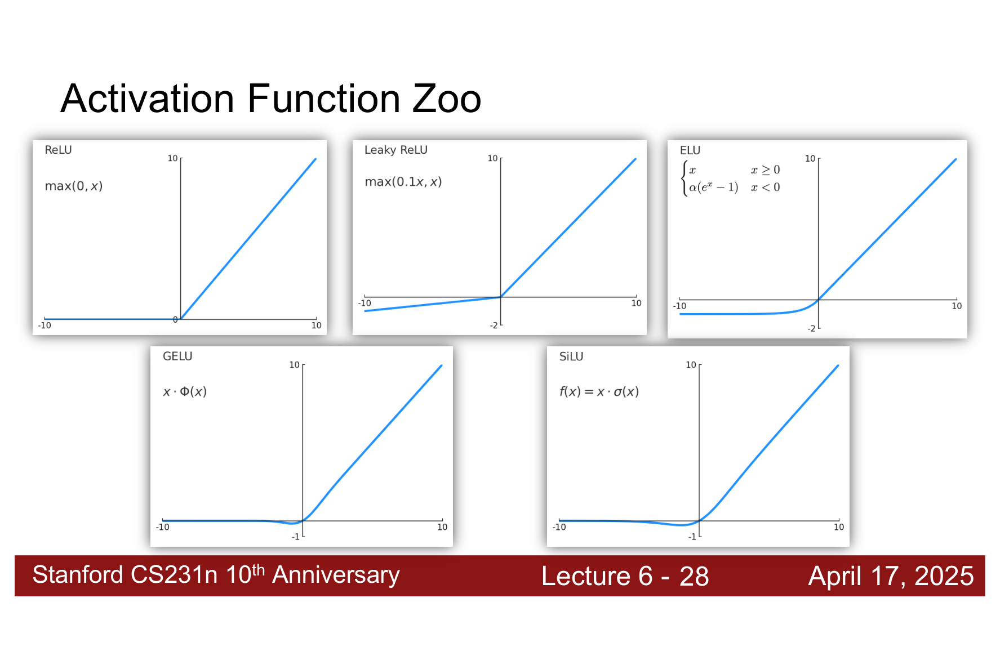

*图 8：常见激活函数。图源：CS231n 2025 Lecture 6，第 28 页。*

### 1. Sigmoid

$$
\sigma(x)=\frac{1}{1+e^{-x}}
$$

输出范围为 $(0,1)$，过去常被解释为神经元的“激活概率”。

主要问题是饱和：当 $x$ 很大或很小时，导数接近 0。

$$
\sigma'(x)=\sigma(x)(1-\sigma(x))
$$

其最大值也只有 0.25。多层梯度连续相乘后，会变得越来越小。

可以把反向传播想成传话：

```text
第 1 层传回 100%
第 2 层只剩 25%
第 3 层只剩 6.25%
第 4 层只剩 1.56%
```

网络越深，前面层收到的学习信号越弱，这就是梯度消失的一种来源。

### 2. ReLU

$$
\operatorname{ReLU}(x)=\max(0,x)
$$

优点：

- 正区间不饱和；
- 计算简单；
- 训练速度通常比 Sigmoid 更快；
- 能产生稀疏激活。

问题是 **Dead ReLU**：如果某个神经元长期处于负区间，其输出和梯度都为 0，可能再也无法恢复。

常见诱因包括：

- 学习率过大；
- 权重更新幅度过大；
- 初始化不合理。

### 3. GELU

$$
\operatorname{GELU}(x)=x\Phi(x)
$$

其中 $\Phi(x)$ 是标准正态分布的累积分布函数。

GELU 不像 ReLU 那样直接把负数全部截断，而是根据输入大小进行“软门控”。

直观地说：

- 很大的正数：基本全部通过；
- 接近 0：部分通过；
- 很大的负数：基本被抑制。

它在 0 附近更加平滑，因此常用于 Transformer 等现代网络，但计算成本略高于 ReLU。

### 4. 激活函数放在哪里？

通常放在线性算子之后：

```text
卷积层 → 归一化层 → 激活函数
```

例如：

```text
Conv → BatchNorm → ReLU
```

没有绝对固定的顺序，不同架构可能采用不同设计，但核心原则是：

> 线性层负责组合特征，激活函数负责引入非线性。

---

## 五、VGG：用小卷积核构建更深的网络

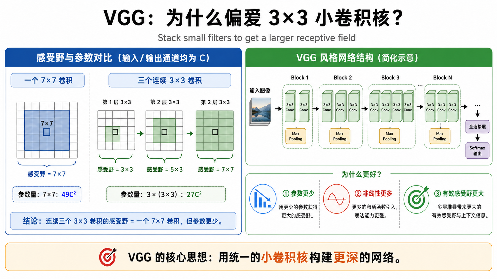

*图 9：VGG 通过堆叠多个 $3\times3$ 卷积获得更大感受野。*


VGG 的设计思想非常统一：

- 主要使用 $3\times3$ 卷积；
- 卷积步幅为 1；
- 填充为 1，保持空间大小；
- 使用 $2\times2$、步幅为 2 的最大池化下采样；
- 将网络深度增加到 16 层或 19 层。

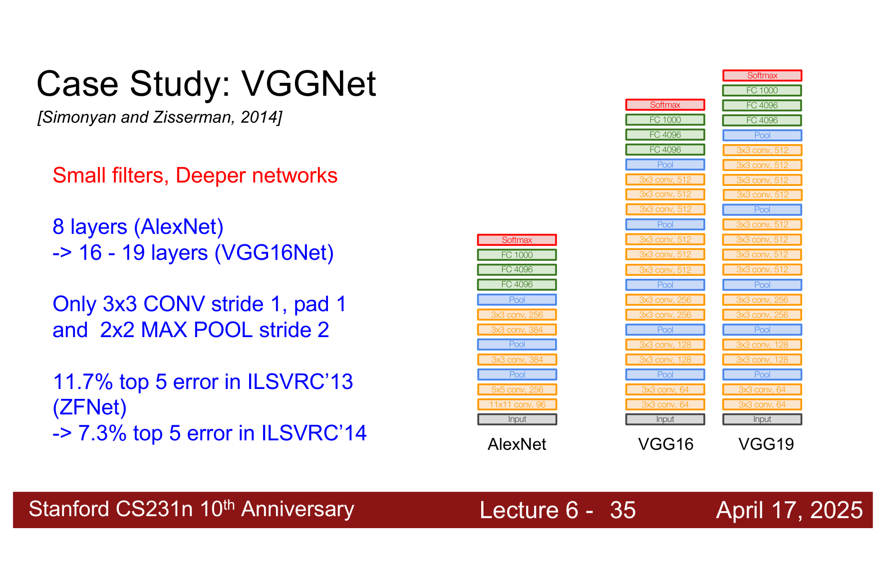

*图 10：AlexNet、VGG16 和 VGG19 的结构对比。图源：CS231n 2025 Lecture 6，第 35 页。*

### 1. 为什么连续使用多个 $3\times3$ 卷积？

连续三个 $3\times3$、步幅为 1 的卷积，其有效感受野为：

$$
3\rightarrow5\rightarrow7
$$

也就是说，三个 $3\times3$ 卷积最终能看到与一个 $7\times7$ 卷积相同大小的区域。

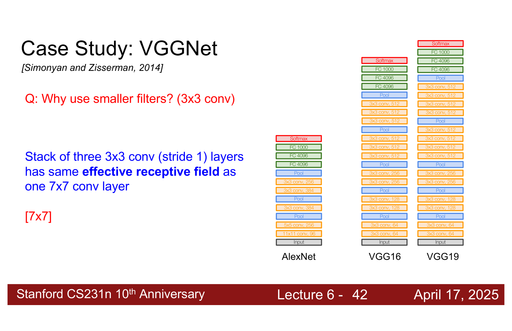

*图 11：三个 $3\times3$ 卷积获得 $7\times7$ 有效感受野。图源：CS231n 2025 Lecture 6，第 42 页。*

假设输入和输出通道数都为 $C$。

一个 $7\times7$ 卷积的参数量约为：

$$
49C^2
$$

三个 $3\times3$ 卷积的参数量约为：

$$
3\times9C^2=27C^2
$$

因此，堆叠小卷积核有两个好处：

1. 参数更少；
2. 中间多了两次激活函数，非线性表达能力更强。

### 2. 感受野可以怎样理解？

可以把每个神经元理解成一个观察员。

- 第一层观察员只看输入图像的 $3\times3$ 区域；
- 第二层观察员读取第一层的 $3\times3$ 个结果，相当于看到原图的 $5\times5$；
- 第三层继续汇总后，相当于看到原图的 $7\times7$。

网络越深，后层神经元能够整合的原始图像范围越大。

### 3. VGG 的问题

VGG 结构清晰，但缺点也明显：

- 网络计算量大；
- 全连接层参数非常多；
- 网络继续加深后越来越难优化。

这也引出了下一种关键架构：ResNet。

---

## 六、ResNet：让网络学习“需要修改多少”

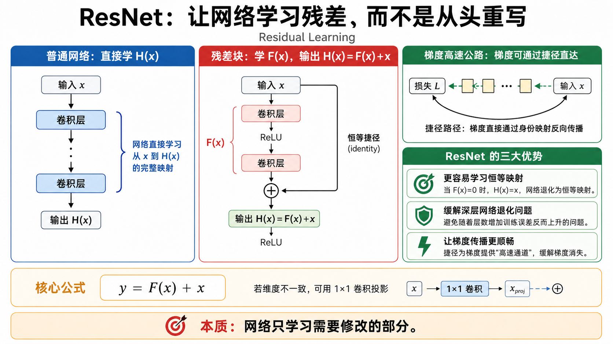

*图 12：ResNet 的残差学习与跳跃连接。*


直觉上，网络越深，参数越多，表达能力应该越强。

但实验发现，在普通网络中，56 层模型的训练误差可能反而高于 20 层模型。

这不是过拟合，因为更深模型连训练集都拟合得更差。这种现象称为 **退化问题**，本质上是优化困难。

### 1. 普通网络在学什么？

普通网络直接学习目标映射：

$$
H(x)
$$

ResNet 改为学习残差：

$$
F(x)=H(x)-x
$$

于是：

$$
H(x)=F(x)+x
$$

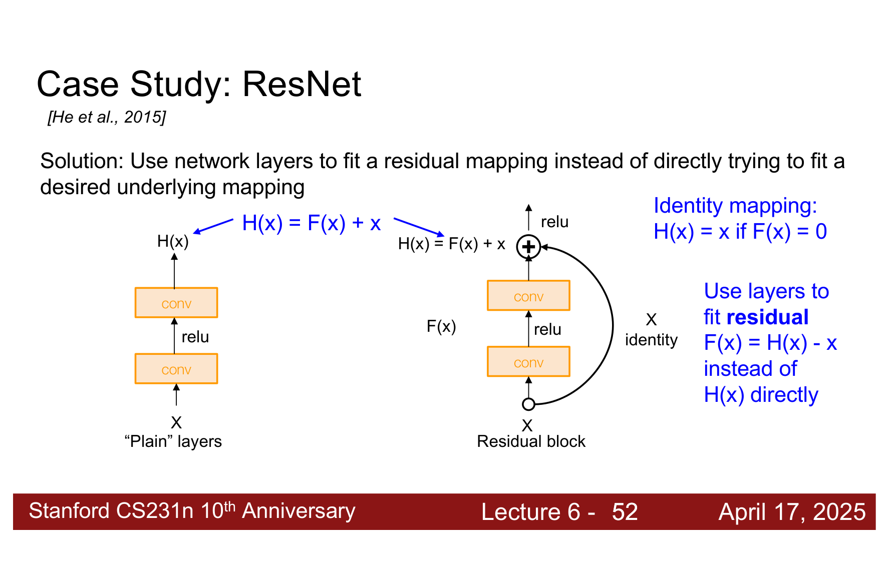

*图 13：普通层与残差块的区别。图源：CS231n 2025 Lecture 6，第 52 页。*

### 2. 为什么学习残差更容易？

假设当前输入已经很好，理想输出就是保持不变：

$$
H(x)=x
$$

普通网络需要让多层卷积精确学习一个恒等映射。

残差网络只需要学习：

$$
F(x)=0
$$

这通常更容易。

可以把它类比为修改论文：

- 普通网络：重新写一篇完整论文；
- 残差网络：在原稿上只写出需要修改的部分。

当原稿已经比较好时，“学习修改量”显然比“从头重写”更容易。

### 3. 跳跃连接为什么有利于梯度传播？

残差块输出为：

$$
y=F(x)+x
$$

反向传播时：

$$
\frac{\partial L}{\partial x}
=
\frac{\partial L}{\partial y}
\left(
\frac{\partial F}{\partial x}+1
\right)
$$

其中的 $1$ 来自恒等连接。

即使 $\partial F/\partial x$ 很小，梯度仍然可以沿着跳跃连接直接向前传播。因此残差连接为信息和梯度提供了一条“高速公路”。

### 4. 输入和输出尺寸不同怎么办？

只有形状相同的张量才能直接相加。

如果残差分支进行了下采样或改变通道数，通常需要在捷径分支中使用 $1\times1$ 卷积进行投影：

$$
y=F(x)+W_sx
$$

其中 $W_s$ 用于调整空间尺寸或通道数。

### 5. ResNet 的整体结构

经典 ResNet 通常：

- 堆叠多个残差块；
- 每个基础残差块包含两个 $3\times3$ 卷积；
- 在不同阶段之间使用步幅 2 下采样；
- 空间尺寸减半时，通道数通常增加；
- 可构建 18、34、50、101、152 层网络。

ResNet 的意义不只是“网络更深”，更重要的是：

> 它通过重新设计优化路径，让深层网络真正变得可训练。

---

## 七、权重初始化：过小信号消失，过大信号爆炸

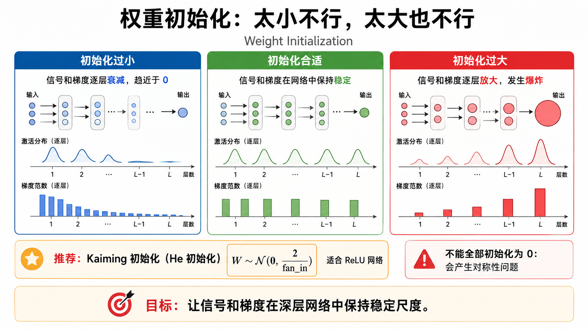

*图 14：初始化过小、合适和过大时的信号传播差异。*


神经网络训练不是从零权重开始，而是从随机权重开始。

### 1. 为什么不能把所有权重初始化为 0？

如果同一层的所有神经元权重都相同，它们会得到完全相同的输出和梯度，之后也会一直做相同的事情。

这样一层中大量神经元就退化成了同一个神经元，无法学习不同特征。这称为对称性问题。

### 2. 权重太小会怎样？

每一层都在做：

$$
x_{l+1}=W_lx_l
$$

如果 $W_l$ 的数值普遍很小，多层连续相乘后，激活值会越来越接近 0：

```text
1.0 → 0.1 → 0.01 → 0.001 → 0.0001
```

后层几乎收不到有效信号，反向传播中的梯度也可能越来越小。

### 3. 权重太大会怎样？

如果权重方差太大，激活值会随着层数迅速放大：

```text
1 → 3 → 9 → 27 → 81
```

数值可能爆炸，训练过程变得不稳定。

因此初始化的目标是：

> 尽量让信号经过多层传播后，仍然保持合理的尺度。

### 4. Kaiming 初始化

对于使用 ReLU 的网络，常用 Kaiming/MSRA 初始化：

$$
W_{ij}\sim\mathcal{N}\left(0,\frac{2}{D_{in}}\right)
$$

其标准差为：

$$
\operatorname{std}(W)=\sqrt{\frac{2}{D_{in}}}
$$

其中 $D_{in}$ 是一个神经元的输入数量，也叫 `fan_in`。

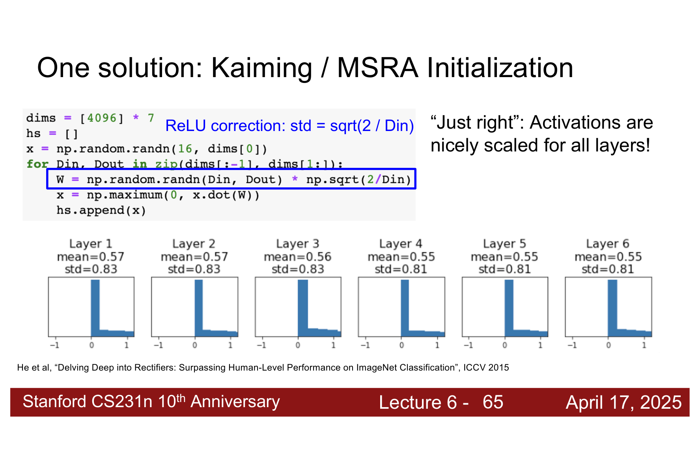

*图 15：Kaiming 初始化使不同深度的激活保持合理尺度。图源：CS231n 2025 Lecture 6，第 65 页。*

为什么分子是 2？

因为 ReLU 会把大约一半的负激活截断为 0。为了补偿这部分方差损失，需要适当增大初始化方差。

常见原则：

- ReLU：Kaiming 初始化；
- tanh 或近似线性激活：Xavier 初始化；
- 偏置：通常可以初始化为 0；
- 不要随意使用一个固定标准差初始化所有网络。

---

## 八、图像预处理：训练集、验证集和测试集必须用同一把尺子

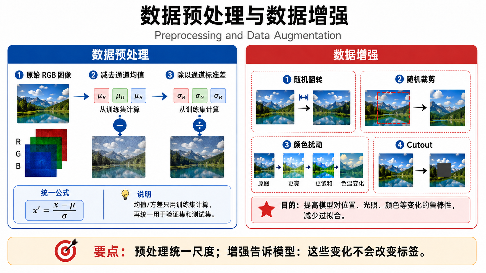

*图 16：图像预处理与常见数据增强方法。*


图像预处理最常见的做法是对每个颜色通道进行中心化和尺度缩放：

$$
x'_{c,h,w}
=
\frac{x_{c,h,w}-\mu_c}{\sigma_c}
$$

其中每个通道都有自己的均值和标准差。

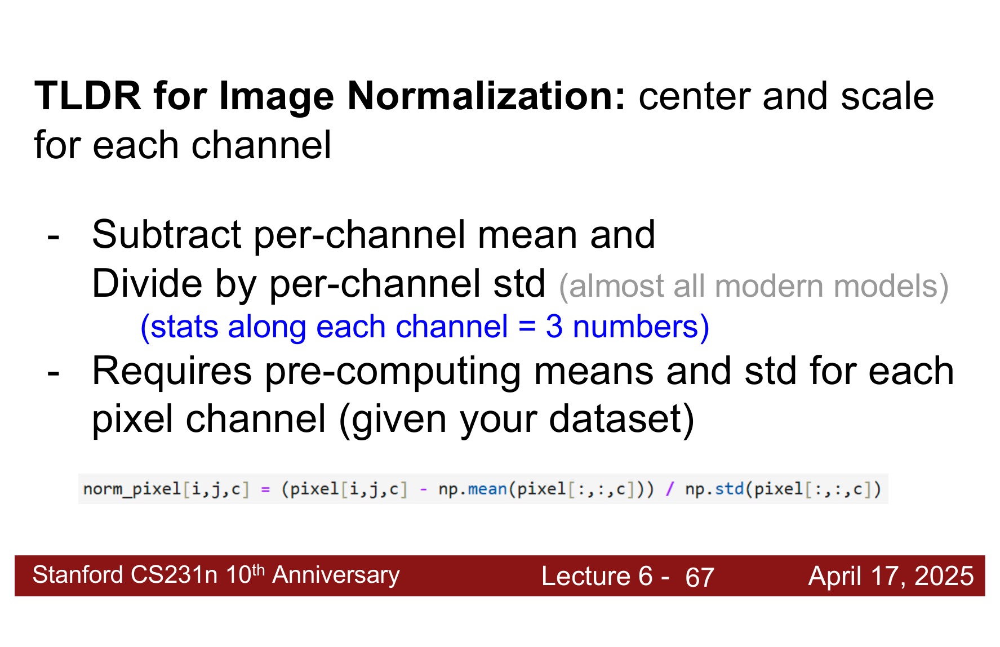

*图 17：图像归一化的核心做法。图源：CS231n 2025 Lecture 6，第 67 页。*

### 1. 为什么要减均值？

如果像素值全部偏大，优化器需要先花力气抵消这个整体偏移。

减均值后，数据大致以 0 为中心，正负方向更平衡，优化通常更容易。

### 2. 为什么要除以标准差？

不同通道的波动范围可能不同。

例如：

```text
红色通道变化范围：0～200
蓝色通道变化范围：0～20
```

如果不缩放，红色通道可能在梯度中占据过大权重。除以标准差后，各通道尺度更加接近。

### 3. 统计量应该从哪里计算？

均值和标准差只能根据 **训练集** 计算，然后同样应用到：

- 训练集；
- 验证集；
- 测试集。

不能单独使用测试集计算统计量，否则测试集信息会泄漏到训练流程中。

使用预训练模型时，应采用该模型预训练时对应的输入处理方式，而不是随意重新设置。

---

## 九、数据增强：不收集新图片，也能制造更多训练情况

数据增强对输入图像做随机变换，同时保持标签不变：

```text
原图：猫
水平翻转后：仍然是猫
轻微裁剪后：仍然是猫
亮度变化后：仍然是猫
```

本质上，它向模型表达了我们对任务的先验知识：

> 图片发生某些合理变化后，类别不应该改变。

### 1. 随机水平翻转

适合：

- 猫、狗、汽车等自然图像；
- 左右方向通常不影响类别的任务。

不一定适合：

- 数字和文字识别；
- 方向本身决定标签的任务；
- 医学影像中的特定左右结构。

增强操作必须符合任务语义。

### 2. 随机裁剪和缩放

训练时随机改变图像尺度，再裁剪固定大小区域。

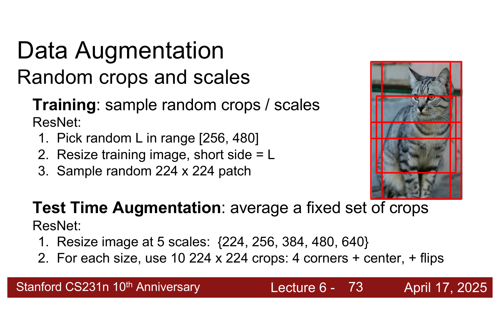

*图 18：随机缩放和随机裁剪。图源：CS231n 2025 Lecture 6，第 73 页。*

这种方法迫使模型不要死记物体在图像中的固定位置和大小。

例如训练集中所有猫都位于正中央，如果不做裁剪，模型可能错误地学到：

> “中央区域有纹理”比“猫的形状”更重要。

随机裁剪后，猫可能出现在左上、右下或只显示一部分，模型必须学习更稳健的特征。

### 3. 颜色扰动

常见操作包括：

- 随机亮度；
- 随机对比度；
- 随机饱和度；
- 随机色调。

它可以减少模型对特定光照和相机条件的依赖。

但颜色增强不能过强，否则会破坏标签语义。例如识别交通灯时，颜色本身就是关键特征。

### 4. Cutout

Cutout 会随机遮挡图像的一块区域。

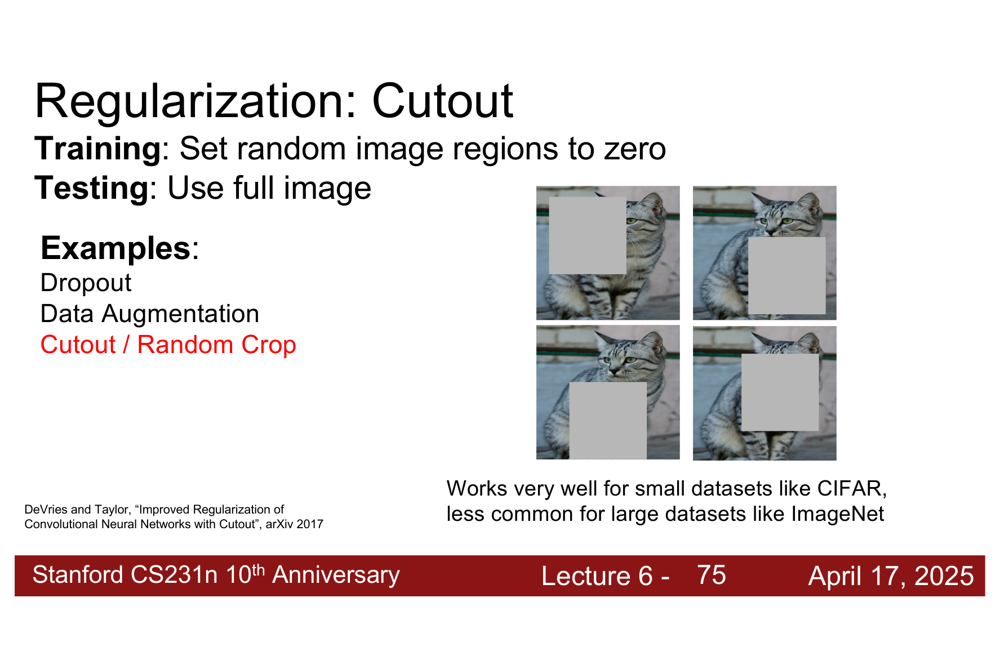

*图 19：Cutout 在训练阶段随机遮挡局部区域。图源：CS231n 2025 Lecture 6，第 75 页。*

它相当于告诉模型：

> 即使物体的一部分被遮挡，也应该尽量完成识别。

这会促使网络使用多个区域的特征，而不是只依赖最显眼的局部纹理。

### 5. 训练和测试时的增强不同

一般流程是：

```text
训练：使用随机增强
验证/测试：使用确定性预处理
```

也可以在测试时对同一图片进行多次裁剪、翻转，再平均预测结果，这称为测试时增强（TTA）。它可能提升精度，但会增加推理成本。

---

## 十、迁移学习：不要每次都从随机参数开始

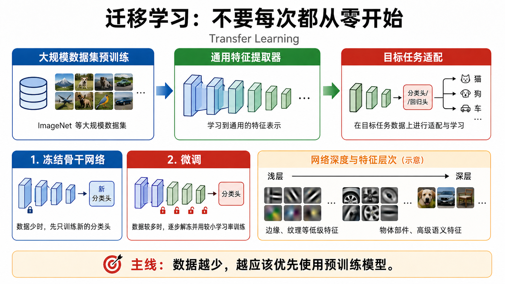

*图 20：从大规模预训练到目标任务适配的迁移学习流程。*


如果自己的数据集很小，从零训练大型 CNN 很容易过拟合。

迁移学习的核心思想是：

> 先使用大规模数据训练模型，再把学到的视觉特征迁移到自己的任务中。

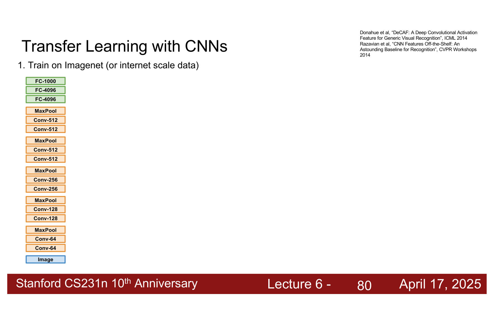

*图 21：先在大规模数据上训练骨干网络，再迁移到目标任务。图源：CS231n 2025 Lecture 6，第 80 页。*

### 1. 为什么预训练特征可以迁移？

CNN 不同深度通常学习不同层次的特征：

```text
浅层：边缘、颜色、简单纹理
中层：角点、图案、局部形状
深层：眼睛、车轮、脸部、物体部件
分类头：针对原数据集的具体类别
```

浅层特征具有较强通用性。无论识别猫、汽车还是工业零件，都需要先检测边缘和纹理。

越靠近输出层，特征通常越依赖原任务。

### 2. 数据很少时：冻结骨干网络

流程为：

```text
预训练模型
├── 特征提取部分：冻结
└── 原分类层：替换为新的分类层并训练
```

例如原模型输出 1000 类，现在自己的数据只有 5 类，就将最后一层替换为 5 类分类器。

这种方法训练速度快，也不容易破坏预训练特征。

### 3. 数据较多时：微调

如果目标数据较多，可以：

- 使用预训练权重初始化；
- 训练新的分类头；
- 再逐步解冻部分或全部网络；
- 使用较小学习率微调。

通常分类头使用较大学习率，骨干网络使用较小学习率，因为：

- 分类头是随机初始化，需要快速学习；
- 骨干网络已有有用特征，不应被剧烈更新破坏。

### 4. 数据规模与任务相似度如何影响策略？

| 目标数据 | 与预训练任务相似 | 与预训练任务差异大 |
|---|---|---|
| 很少 | 冻结骨干，只训练分类头 | 寻找更合适的预训练模型，或收集更多数据 |
| 较多 | 微调整个模型 | 尝试全量微调，也可与从零训练比较 |

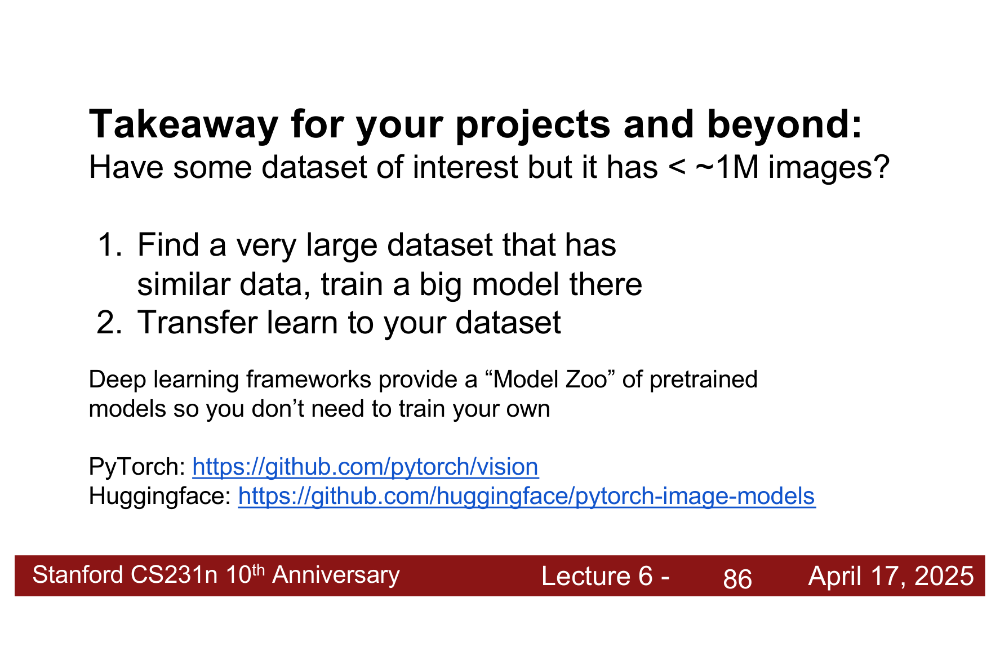

*图 22：数据不足时优先使用大规模预训练模型。图源：CS231n 2025 Lecture 6，第 86 页。*

这也是当前深度学习中的常见工作方式：

```text
大规模预训练 → 下游任务适配
```

迁移学习并不是偷懒，而是在利用已经付出过的计算和数据成本。

---

## 十一、超参数选择：先确认代码能学，再追求高精度

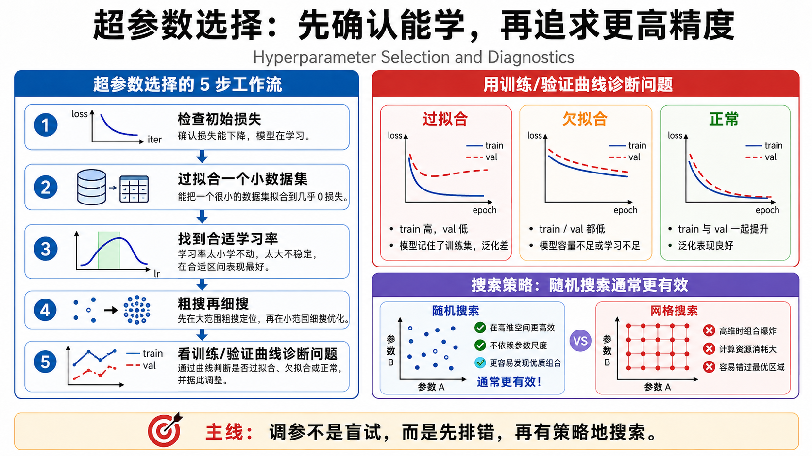

*图 23：超参数调试、训练曲线诊断与搜索策略。*


很多训练失败并不是模型结构不够先进，而是：

- 标签读取错误；
- 损失函数用错；
- 学习率不合适；
- 数据预处理不一致；
- 正则化过强；
- 训练时间不足。

因此调参应该按照固定顺序进行。

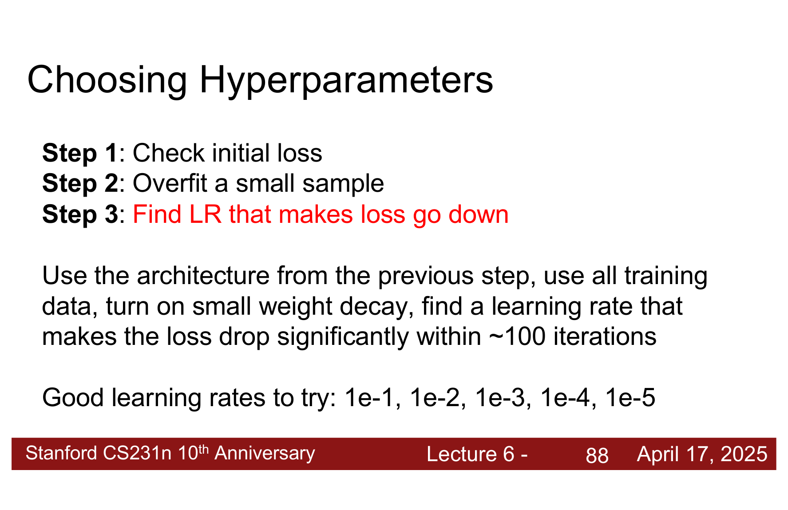

*图 24：超参数选择流程。图源：CS231n 2025 Lecture 6，第 88 页。*

### 第一步：检查初始损失

对于 $C$ 类分类问题，如果模型初始输出接近均匀分布：

$$
p(y=c)=\frac{1}{C}
$$

交叉熵损失应约为：

$$
L=-\log\frac{1}{C}=\log C
$$

例如 10 分类：

$$
L\approx\log 10\approx2.30
$$

如果初始损失远离这个数量级，就要检查：

- 标签范围是否正确；
- Softmax 和交叉熵是否重复使用；
- 损失是否正确取平均；
- 输出类别数是否匹配。

### 第二步：让模型过拟合一个很小的数据集

选取少量样本，例如 20～100 张图片：

- 暂时关闭强数据增强；
- 减小或关闭权重衰减、Dropout；
- 训练到接近 100% 训练准确率。

这一步不是为了得到好模型，而是进行系统自检。

如果大型网络连几十个样本都记不住，通常说明：

- 实现存在错误；
- 梯度没有正常传播；
- 学习率完全不合适；
- 数据和标签没有正确对应。

### 第三步：寻找能让损失明显下降的学习率

可以按数量级尝试：

```text
1e-1、1e-2、1e-3、1e-4、1e-5
```

观察前几十到一百次迭代：

- 损失几乎不变：学习率可能太小；
- 损失快速下降：学习率可能合适；
- 损失剧烈震荡或变成 NaN：学习率可能太大。

学习率通常是最重要的超参数之一。

### 第四步：先粗搜索，再精细搜索

合理流程是：

1. 先在较大范围内粗略搜索；
2. 每组参数训练少量 epoch；
3. 找到表现较好的区域；
4. 缩小范围后进一步搜索；
5. 对候选配置训练更长时间。

对于学习率、权重衰减等跨越多个数量级的参数，应在对数空间采样，例如：

$$
\eta=10^u,\quad u\sim U(-5,-1)
$$

而不是在线性区间中均匀采样。

### 第五步：学会看训练曲线

#### 情况 A：训练和验证准确率仍在同时上升

说明模型可能还没有训练完，应继续训练或调整学习率调度。

#### 情况 B：训练准确率很高，验证准确率明显较低

这是典型过拟合：

```text
训练集表现好
验证集表现差
```

可以考虑：

- 增强数据；
- 增大权重衰减；
- 使用 Dropout；
- 减小模型；
- 提前停止；
- 收集更多数据。

#### 情况 C：训练和验证准确率都低，而且差距很小

这是典型欠拟合。

可以考虑：

- 训练更久；
- 使用更大的模型；
- 减小正则化；
- 改进优化器或学习率；
- 检查输入特征和标签质量。

### 第六步：随机搜索通常优于网格搜索

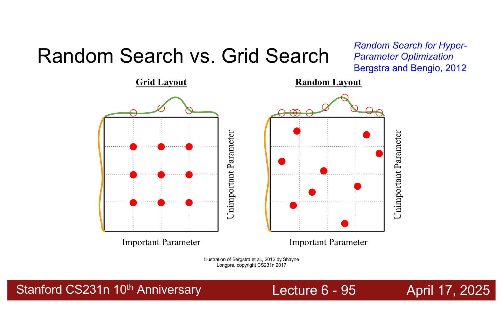

*图 25：当只有少数超参数真正重要时，随机搜索更容易覆盖关键方向。图源：CS231n 2025 Lecture 6，第 95 页。*

假设只有学习率真正重要，而另一个参数影响很小。

网格搜索可能只测试 3 个不同学习率，却在不重要的参数上重复大量组合。

随机搜索则更可能测试许多不同学习率，因此更容易找到有效区域。

> 调参不是机械地遍历所有组合，而是尽快发现哪些参数最重要，并把计算资源集中到这些方向上。

---

## 十二、本讲知识串联

这一讲的内容可以串成一条完整的 CNN 工作流：

```text
1. 选择网络模块
   Conv / Pool / Norm / Activation / Dropout

2. 选择网络架构
   VGG：小卷积核、深层堆叠
   ResNet：残差映射、跳跃连接

3. 正确初始化参数
   ReLU 网络优先考虑 Kaiming 初始化

4. 处理数据
   按通道减均值、除标准差

5. 加入合理的数据增强
   翻转、裁剪、颜色扰动、Cutout

6. 数据不足时使用迁移学习
   冻结特征提取器或微调整个模型

7. 按顺序调试训练流程
   检查初始损失 → 过拟合小样本 → 找学习率

8. 根据训练曲线诊断问题
   欠拟合、过拟合、训练不足或学习率异常
```

---

## 十三、最需要记住的结论

1. CNN 通常由卷积、归一化、激活、下采样和分类层共同组成。
2. 归一化先稳定数据尺度，再由 $\gamma$、$\beta$ 恢复可学习的表达能力。
3. Dropout 通过随机删除神经元，减少特征共适应并提升泛化能力。
4. ReLU 简单高效，但可能出现 Dead ReLU；GELU 更平滑，但计算成本更高。
5. VGG 用多个 $3\times3$ 卷积获得大感受野，同时减少参数并增加非线性。
6. ResNet 学习残差 $F(x)=H(x)-x$，使深层网络更容易优化。
7. 权重过小会导致信号消失，过大会导致信号爆炸；ReLU 网络常用 Kaiming 初始化。
8. 图像预处理的均值和标准差应由训练集计算，并统一用于验证集和测试集。
9. 数据增强必须保持标签语义不变，不能盲目使用。
10. 数据不足时，优先考虑预训练模型和迁移学习，而不是从零训练大型网络。
11. 调参前先检查初始损失，并确认模型能够过拟合一个小数据集。
12. 随机搜索通常比网格搜索更有效，尤其是在只有少数关键超参数时。

可以用一句话概括本讲：

> 一个 CNN 能否取得好结果，不仅取决于网络有多深，还取决于归一化、激活函数、初始化、数据处理、迁移学习和调参流程是否合理。

---

## 参考资料

1. Stanford CS231n Spring 2025, Lecture 6: *Training CNNs and CNN Architectures*.
2. Ba, Kiros, and Hinton. *Layer Normalization*. 2016.
3. Srivastava et al. *Dropout: A Simple Way to Prevent Neural Networks from Overfitting*. JMLR, 2014.
4. Simonyan and Zisserman. *Very Deep Convolutional Networks for Large-Scale Image Recognition*. 2014.
5. He et al. *Deep Residual Learning for Image Recognition*. 2015.
6. He et al. *Delving Deep into Rectifiers: Surpassing Human-Level Performance on ImageNet Classification*. ICCV, 2015.
7. DeVries and Taylor. *Improved Regularization of Convolutional Neural Networks with Cutout*. 2017.
8. Bergstra and Bengio. *Random Search for Hyper-Parameter Optimization*. JMLR, 2012.
